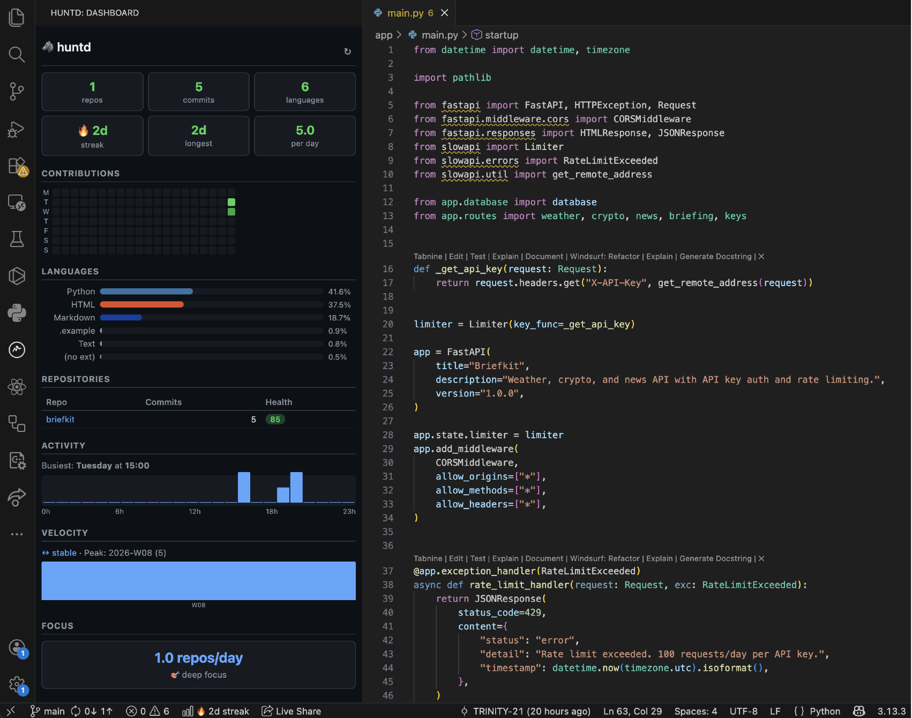

# huntd for VS Code

**Your coding fingerprint — right in VS Code.**

See streaks, heatmaps, language stats, repo health, achievements, and more — all from your local git history.

<p align="center">
  
</p>

## Requirements

Install the huntd CLI first:

```bash
pip install huntd
```

## Features

- **Sidebar dashboard** — Overview stats, contribution heatmap, languages, repos, activity, velocity, focus score, work split, and achievements
- **Status bar streak** — Your current coding streak displayed in the bottom bar
- **Auto-refresh** — Dashboard updates when you commit (watches `.git/` for changes)
- **Settings** — Configure scan path, author filter, and refresh interval

## Usage

1. Open a workspace folder containing git repos
2. Click the huntd icon in the activity bar (left sidebar)
3. The dashboard loads automatically

## Settings

| Setting | Default | Description |
|---------|---------|-------------|
| `huntd.scanPath` | workspace root | Path to scan for git repos |
| `huntd.authorFilter` | (all) | Filter commits by author name or email |
| `huntd.autoRefresh` | `true` | Auto-refresh when git changes are detected |
| `huntd.refreshInterval` | `60` | Auto-refresh interval in seconds |

## Commands

- **Huntd: Open Dashboard** — Focus the sidebar dashboard
- **Huntd: Refresh** — Manually refresh the dashboard

## Links

- [huntd CLI on PyPI](https://pypi.org/project/huntd/)
- [huntd on GitHub](https://github.com/TRINITY-21/huntd)

## License

MIT
