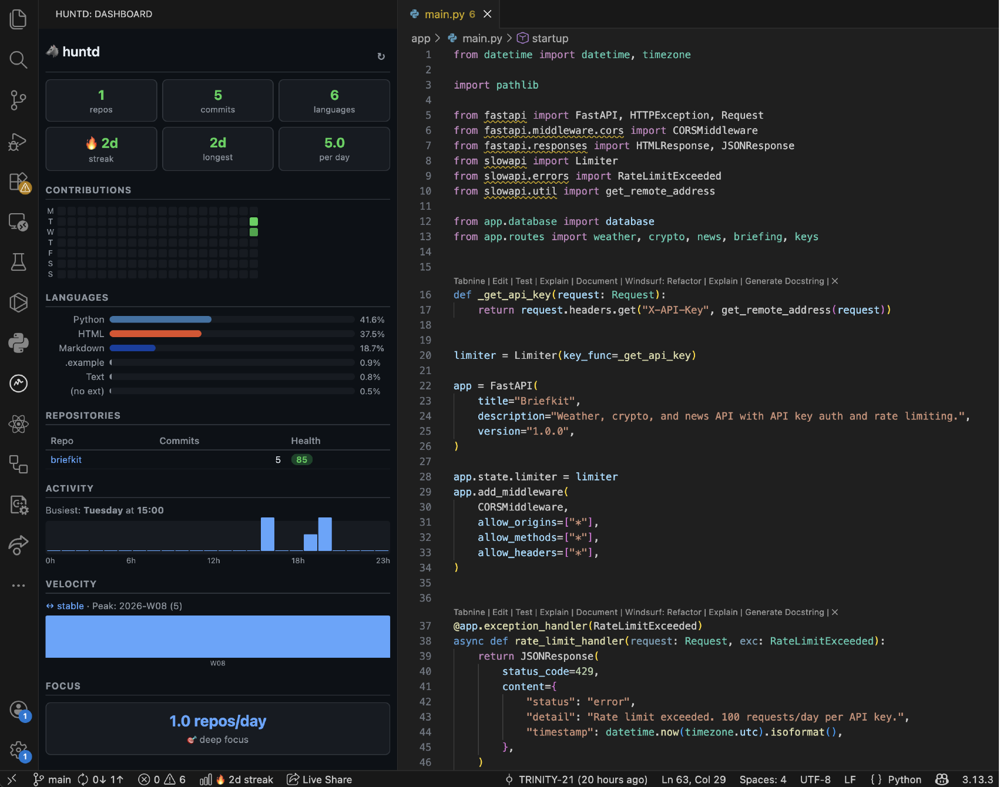

# huntd for VS Code

**Your coding fingerprint — right in VS Code.**
> A VS Code extension that visualizes your local git history in the sidebar — coding streaks, contribution heatmaps, language breakdowns, achievements, and repo health, all updated live as you work.

Like the GitHub contribution graph, but for **everything you actually code** — including private and offline work that GitHub never sees.

See streaks, heatmaps, language stats, repo health, achievements, and more — all from your local git history.

<p align="center">
  
</p>


## Features

- **Streaks & heatmap** — daily contribution graph across all your local repos.
- **Language breakdown** — what you actually spend time writing, by week and by repo.
- **Repo health scores** — commit recency, branch hygiene, stale-branch counts.
- **Achievements** — small unlockables for hitting streaks, language milestones, etc.
- **Auto-refresh** — picks up new commits as soon as you make them.
- **No cloud, no API keys** — everything runs locally against your file system.

## Install

From the VS Code Marketplace: search for **"huntd"**.

Or from `.vsix`:

```sh
git clone https://github.com/TRINITY-21/huntd-vscode.git
cd huntd-vscode
npm install
npm run package
code --install-extension huntd-vscode-*.vsix
```

## How it works

The extension scans configured directories for `.git` folders, parses commit history with `simple-git`, and renders the dashboard in a webview panel. No data leaves your machine.

## Companion CLI

There's a terminal version with the same dashboard at [TRINITY-21/huntd](https://github.com/TRINITY-21/huntd) — `pip install huntd`.

## Tech

TypeScript · VS Code Extension API · `simple-git` · webview UI

## Why

I wanted to know what I was actually working on — beyond what shows up on a public GitHub profile. Most of my day is private repos, client work, and side projects that never get pushed. `huntd` makes that work visible to me.

## License

MIT

---

Built by [Joseph Yaw Agyeman](https://jagyeman.dev) · [@TRINITY-21](https://github.com/TRINITY-21)
